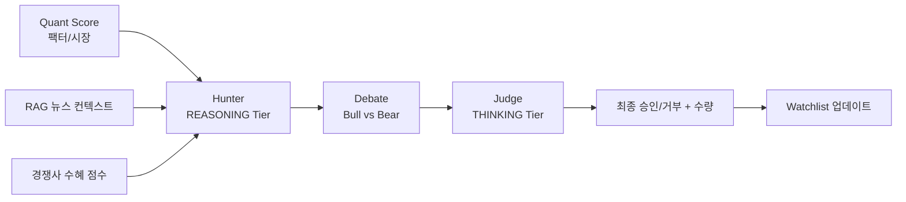
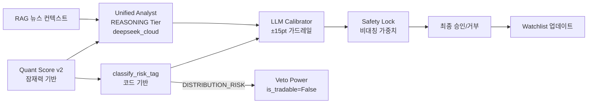

# my-prime-jennie - LLM Decision Chain

## Legacy 경로 (Hunter → Debate → Judge)

## Unified Analyst 경로 (현행, `SCOUT_USE_UNIFIED_ANALYST=true`)

3→1 LLM 호출 통합. Hunter+Debate+Judge를 단일 `run_analyst_scoring()` 호출로 대체.

- **코드 기반 risk_tag**: LLM의 100% CAUTION 편향을 해소하기 위해 `classify_risk_tag(quant_result)`로 산정
- **±15pt 가드레일**: `llm_score = clamp(raw, quant-15, quant+15)` — LLM 점수가 Quant에서 크게 벗어나지 못함
- **Veto Power**: DISTRIBUTION_RISK 태그 시 `is_tradable=False`, `trade_tier=BLOCKED`
- **Safety Lock 비대칭**: LLM 경고 존중 (40:60), LLM<40 가중 (45:55)

