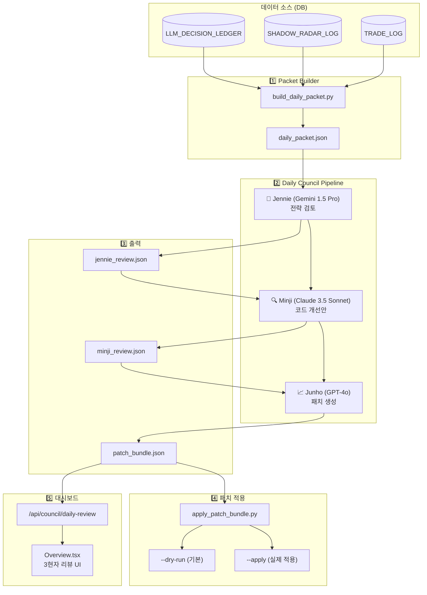

# 3현자 리뷰 시스템 (Three Sages Council) - 아키텍처 문서

> **my-prime-jennie v1.1** - AI 에이전트와 LLM이 협업하여 시스템을 자율 개선하는 Daily Council 시스템

---

## 1. 개요

**3현자 리뷰 시스템 (Three Sages Council)**은 3개의 서로 다른 LLM 에이전트가 **순차적으로 협업**하여 트레이딩 시스템의 의사결정을 검토하고 개선안을 도출하는 자율 진화형 파이프라인입니다.

### 핵심 가치
- **Human-in-the-Loop**: 최종 패치 적용은 사람의 승인을 거침
- **다양한 관점**: 3개의 다른 AI 모델이 각자의 전문성으로 검토
- **안전한 자동화**: 허용된 파일 범위 내에서만 패치 생성

---

## 2. 시스템 아키텍처

### 2.1 전체 흐름



### 2.2 3현자 역할 분담

| 현자 | LLM 모델 | 역할 | 주요 관점 |
|------|----------|------|-----------|
| **👑 Jennie** | Gemini 1.5 Pro | Chief Strategist | 전략적 관점에서 Hunter의 선택과 Veto 결정을 비평 |
| **🔍 Minji** | Claude 3.5 Sonnet | Lead Engineer | Jennie의 피드백을 구체적인 코드 개선안으로 변환 |
| **📈 Junho** | GPT-4o | Operations Manager | 최종 패치 번들 생성, 안전성 게이트키퍼 역할 |

---

## 3. 디렉토리 구조

```
my-prime-jennie/
├── scripts/
│   ├── build_daily_packet.py    # DB → Daily Packet 생성
│   ├── run_daily_council.py     # Packet → Council → Bundle
│   └── apply_patch_bundle.py    # Bundle → Codebase 적용
├── prompts/
│   └── council/
│       ├── jennie_system.txt    # Jennie 시스템 프롬프트
│       ├── minji_system.txt     # Minji 시스템 프롬프트
│       └── junho_system.txt     # Junho 시스템 프롬프트
├── schemas/
│   ├── daily_packet.schema.json
│   ├── jennie_review.schema.json
│   ├── minji_review.schema.json
│   └── patch_bundle.schema.json
├── runs/
│   └── YYYY-MM-DD/
│       └── daily_packet.json    # 일일 입력 데이터
└── reviews/
    └── YYYY-MM-DD/
        ├── jennie_review.json
        ├── minji_review.json
        └── patch_bundle.json    # 최종 산출물
```

---

## 4. 상세 구현

### 4.1 Daily Packet Generator (`build_daily_packet.py`)

DB에서 당일(또는 지정일)의 의사결정 로그를 조회하여 **대표 케이스 6~10개**를 추출합니다.

#### 샘플링 전략
| 카테고리 | 개수 | 설명 |
|----------|------|------|
| **VETO** | 2개 | `ShadowRadarLog`에서 거부된 케이스 |
| **VIOLATION** | 2개 | 규칙 위반 또는 로직 갭 발생 케이스 |
| **WORST** | 1개 | 최악의 성과 (손실 또는 NO_DECISION) |
| **BEST** | 1개 | 최고 성과 (BUY 결정 + 높은 Hunter Score) |
| **NORMAL** | 1~2개 | 일반적인 샘플 |

#### 보안 처리
- **Allowlist 기반 필드 추출**: 민감 정보(API Key, 계좌 등) 제외
- 허용 필드: `case_id`, `category`, `symbol`, `reasoning_summary`, `model_decision`, `market_context` 등

#### 출력 스키마 (`daily_packet.schema.json`)
```json
{
  "date": "2025-12-19",
  "summary_stats": {
    "veto_count": 12,
    "no_trade_ratio": 0.85,
    "total_scanned": 150,
    "selected_candidates": 5
  },
  "representative_cases": [
    {
      "case_id": "veto_123",
      "category": "VETO",
      "symbol": "005930",
      "reasoning_summary": "Filter rejection at Gate stage",
      "model_decision": "REJECT",
      "market_context": "Bearish sector"
    }
  ]
}
```

---

### 4.2 Council Runner (`run_daily_council.py`)

3개의 LLM을 **순차적으로 호출**하며 각 단계의 출력이 다음 단계의 입력이 됩니다.

#### 실행 흐름

```python
# 1. Jennie (Gemini) - 전략 검토
jennie_prompt = jennie_system + daily_packet
jennie_review = GeminiLLMProvider.generate_json(jennie_prompt, jennie_schema)

# 2. Minji (Claude) - 코드 개선안
minji_prompt = minji_system + daily_packet + jennie_review
minji_review = ClaudeLLMProvider.generate_json(minji_prompt, minji_schema)

# 3. Junho (GPT-4) - 패치 번들 생성
junho_prompt = junho_system + minji_review + jennie_review
patch_bundle = OpenAILLMProvider.generate_json(junho_prompt, patch_bundle_schema)
```

#### 신뢰성 보장
- **JSON 스키마 검증** 필수
- 실패 시 **1회 재시도** (2회 실패 시 해당 단계 중단)
- API Rate Limit (429) / Timeout 발생 시 **Backoff 정책** 적용

---

### 4.3 에이전트별 프롬프트 및 스키마

#### 👑 Jennie (Strategist)
**프롬프트 핵심:**
- Daily Packet의 Hunter 선택과 Veto 결정을 비평
- "왜 Best를 놓쳤는가?", "왜 Worst를 선택했는가?" 분석
- Veto 패턴에서 필터가 너무 엄격/느슨한지 판단

**출력 스키마 (`jennie_review.schema.json`):**
```json
{
  "reviewer": "Jennie",
  "feedback": [
    {
      "target_case_id": "veto_123",
      "critique": "유동성 필터가 과도하게 엄격함",
      "suggestion": "거래량 기준을 10% 완화 권장"
    }
  ],
  "generic_advice": "시장 국면에 따른 동적 필터링 도입 필요"
}
```

---

#### 🔍 Minji (Engineer)
**프롬프트 핵심:**
- Jennie의 전략 피드백을 **구체적인 코드 변경**으로 변환
- 파일 경로와 변수명을 명시
- 안전성 우선: 시스템 크래시 유발 변경 금지
- 최소 침습적 변경 선호

**출력 스키마 (`minji_review.schema.json`):**
```json
{
  "reviewer": "Minji",
  "code_improvements": [
    {
      "file_path": "services/scout-job/scout_pipeline.py",
      "issue": "cutoff_ratio가 고정값으로 시장 변동에 대응 불가",
      "proposed_fix": "cutoff_ratio를 market_regime에 따라 동적 조정"
    }
  ],
  "risk_assessment": "Low - 기존 로직 변경 없이 파라미터만 조정"
}
```

---

#### 📈 Junho (Operator)
**프롬프트 핵심:**
- Minji의 코드 개선안을 **패치 번들**로 종합
- **위험한 코드 거부**: `main.py`, `execution_engine.py` 등 핵심 로직 변경 불가
- **허용 대상**: `prompts/`, `schemas/`, `rules/`, `tests/`, 파라미터 파일
- Unified Diff 형식으로 변경사항 생성

**출력 스키마 (`patch_bundle.schema.json`):**
```json
{
  "bundle_id": "patch_20251219_001",
  "created_at": "2025-12-19T18:00:00Z",
  "patches": [
    {
      "target_file": "prompts/hunter_system.txt",
      "description": "유동성 필터 기준 완화",
      "diff": "--- a/prompts/hunter_system.txt\n+++ b/prompts/hunter_system.txt\n@@ -10,7 +10,7 @@\n-MIN_VOLUME = 1000000\n+MIN_VOLUME = 900000",
      "safety_check": true
    }
  ]
}
```

---

### 4.4 Patch Applicator (`apply_patch_bundle.py`)

**안전한 패치 적용**을 위한 스크립트입니다.

#### 실행 모드
| 모드 | 명령어 | 동작 |
|------|--------|------|
| Dry Run (기본) | `--dry-run` | 변경 사항 출력만, 실제 파일 수정 없음 |
| 실제 적용 | `--apply` | 파일에 패치 적용 |

#### 안전 게이트
1. **허용 대상 제한**:
   - ✅ 허용: `schemas/`, `prompts/`, `rules/`, `tests/`
   - ❌ 금지: Core Logic (`main.py`, `execution_engine.py`), Secrets
2. **Git 브랜치 백업**: 적용 전 자동 생성
3. **Smoke Test**: 적용 후 실패 시 자동 Rollback

---

### 4.5 Dashboard API & Frontend

#### Backend API (`/api/council/daily-review`)

**파일:** `services/dashboard/backend/main.py`

```python
@app.get("/api/council/daily-review")
async def get_three_sages_review_api(payload: dict = Depends(verify_token)):
    """3현자 데일리 리뷰 조회"""
    # 1. Redis에서 최신 리뷰 조회
    # 2. 없으면 DB DAILY_COUNCIL_LOG 테이블 조회
    # 3. Jennie/Minji/Junho 각각의 리뷰 + consensus + action_items 반환
```

**응답 형식:**
```json
{
  "date": "2025-12-19",
  "sages": [
    {"name": "Jennie", "role": "수석 심판", "icon": "👑", "review": "..."},
    {"name": "Minji", "role": "리스크 분석가", "icon": "🔍", "review": "..."},
    {"name": "Junho", "role": "전략가", "icon": "📈", "review": "..."}
  ],
  "consensus": "필터 완화 및 동적 조정 도입 합의",
  "action_items": ["cutoff_ratio 10% 완화", "백테스트 검증 필요"]
}
```

#### Frontend Component (`Overview.tsx`)

```tsx
// React Query로 데이터 조회
const { data: councilReview } = useQuery({
  queryKey: ['council-review'],
  queryFn: councilApi.getDailyReview,
  refetchInterval: 600000, // 10분마다
})

// UI 렌더링: 3명의 현자 카드 + 합의사항 + Action Items
```

---

## 5. 5대 핵심 원칙

> [!IMPORTANT]
> Daily Council 파이프라인을 운영할 때 반드시 준수해야 하는 원칙

1. **"daily_packet은 원천 로그를 덤프하지 않으며, 대표 케이스 6~10개만 포함한다."**
2. **"외부 API로 전송되는 모든 데이터는 민감정보 allowlist 기반으로 추출한다."**
3. **"리뷰 응답은 JSON 스키마 검증을 통과해야 하며, 실패 시 1회 재요청 후 중단한다."**
4. **"patch_bundle 자동 적용은 안전 범위(스키마/프롬프트/룰/테스트)로 제한하고, 핵심 실행 로직은 금지한다."**
5. **"confidence 최종 산수는 코드에서 수행하며 모델에게 산수를 맡기지 않는다."**

---

## 6. 실행 방법

### 6.1 수동 실행

```bash
# 1. Daily Packet 생성
python scripts/build_daily_packet.py --date 2025-12-19 --output runs/2025-12-19/daily_packet.json

# 2. Council 실행
python scripts/run_daily_council.py \
  --input runs/2025-12-19/daily_packet.json \
  --output-dir reviews/2025-12-19/

# 3. 패치 적용 (Dry Run)
python scripts/apply_patch_bundle.py \
  --bundle reviews/2025-12-19/patch_bundle.json \
  --dry-run

# 4. 실제 적용 (Human Approval 필요)
python scripts/apply_patch_bundle.py \
  --bundle reviews/2025-12-19/patch_bundle.json \
  --apply
```

### 6.2 Mock 모드 (테스트)

```bash
python scripts/run_daily_council.py \
  --input runs/2025-12-19/daily_packet.json \
  --output-dir reviews/2025-12-19/ \
  --mock  # 실제 LLM 호출 없이 더미 데이터 생성
```

---

## 7. 테스팅

| 테스트 유형 | 파일 | 설명 |
|-------------|------|------|
| Unit Test | `test_schema_validation.py` | JSON 스키마 정합성 검증 |
| Smoke Test | `test_pipeline_smoke.py` | Dummy Data 기반 E2E 파이프라인 관통 테스트 |

---

## 8. 향후 개선 계획

- [ ] 자동 스케줄링: 매일 시장 마감 후 자동 실행 (Cron/Scheduler)
- [ ] 패치 이력 관리: `PATCH_HISTORY` 테이블 생성
- [ ] 성과 추적: 적용된 패치의 효과 측정 (Before/After 비교)
- [ ] Slack/Discord 알림: 패치 번들 생성 시 알림 발송

---

*작성: my-prime-jennie v1.0 (2025-12-19)*
