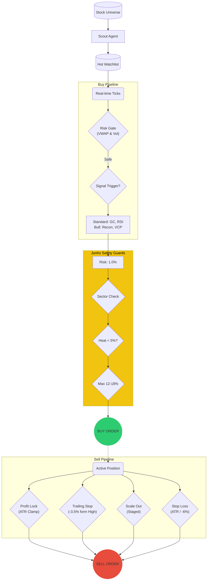

# Visualization Request: Quantum Jump Trading System Logic

## 1. Overview for the Visualizer (AI/Human)
**Context**: This is a request to visualize the logic of a sophisticated, autonomous AI trading agent named "Prime Jennie". The system has recently undergone a major upgrade called **"Quantum Jump"**, moving from a conservative MVP to an aggressive, complex trading machine.

**Goal**: Create a **Two-Part Visualization**:
1.  **Logic Flow (Workflow)**: The invisible decision-making pipeline.
2.  **Chart Interaction (UI)**: A realistic dashboard view showing HOW these logics appear on a price chart.

**Key Themes**:
- **Aggressive yet Guarded**: Higher risk per trade (1.0%) but with strict Portfolio Heat and Sector limits.
- **Dark Fintech Aesthetic**: Deep dark background, neon trend lines, futuristic gradients.

---

## 2. Buy Logic Pipeline (The "Hunter" Phase)

### A. Scouting & Filtering (Batch)
- **Input**: KOSPI/KOSDAQ Universe
- **Step 1: AI Scoring (Hunter & Judge)**
    - **News/Sentiment**: Negative news filter (Hunter)
    - **Technical Score**: Trend, Volume, Support/Resistance
    - **Pass Condition**: `Hunter Score >= 70` (Normal) or `Score >= 90` (Super Prime)
- **Output**: **Hot Watchlist** (Top 10-20 stocks)

### B. Real-time Opportunity Watcher (Stream)
- **Input**: Real-time tick data for Watchlist items
- **Step 2: Pre-Entry Gates**
    - **No-Trade Window**: 09:00 ~ 09:30 (Exceptions: Liquidity & Spread ok)
    - **Risk Filter (AND Condition)**: 
        - Block if `VWAP Disparity > 2%` **AND** `Volume > 2x Avg` (News pump prevention)
    - **Cooldown**: 180 seconds between signals
- **Step 3: Signal Triggers**
    - **Standard**: Golden Cross (MA5 > MA20), RSI Rebound (30 -> Up), Momentum (>3%)
    - **Bull Market Specials**: 
        - `RECON_BULL_ENTRY` (Score > 70 + Recon Tier)
        - `VCP_BREAKOUT` (Volatility Contraction + Vol Breakout)
        - `VOLUME_BREAKOUT` (New High + Vol 3x)

### C. Position Sizing (The "Junho" Guards)
- **Step 4: Calculation**
    - **Base Risk**: `1.0%` of Total Equity per trade.
    - **Sector Discount**: If `Same Sector` exists in portfolio -> Risk `x 0.7`.
    - **ATR Parity**: `Qty = (Equity * Risk%) / (ATR * 2.0)`
- **Step 5: Final Gates (The "Heat" Check)**
    - **Portfolio Heat**: reject if `Sum(Current Portfolio Risk) + New Risk > 5.0%`.
    - **Max Weight**: Cap at `12%` (default) or `18%` (if Score >= 80).

---

## 3. Sell Logic Pipeline (The "Reviewer" Phase)

### D. Profit Taking (Offense)
- **Profit Lock (Dynamic & Clamped)**
    - `L1`: Min 1.5% ~ Max 3.0% -> Lock `Breakeven`
    - `L2`: Min 3.0% ~ Max 5.0% -> Lock `+1.0% Profit`
- **Trailing Stop**: drops 3.5% from High (active after +5%).
- **Scale Out**: Sell 15-25% at staged profit levels.

### E. Loss Cutting (Defense)
- **ATR Stop**: `Entry - (ATR * 2.0)`.
- **Hard Stop**: `-6.0%`.

---

## 4. Visual Component Specification (The "Chart" View)

Please include a mock-up of the **Trading Chart** that reflects these logics.
Use the following style guide matches our current dashboard (`VisualLogic.tsx`):

### A. Style Guide
- **Background**: Deep Dark Gradient (`#0D0D0F` to `#1A1A1F`).
- **Candles**: Red (Up) / Blue (Down) for Korean market style, or Green/Red default.
- **Lines**:
    - **MA5**: Neon Blue (`#007AFF`)
    - **MA20**: Neon Orange (`#FF9500`)
    - **MA120**: Muted Grey (`#636366`, dotted)
    - **Bollinger Band**: Translucent Blue overlay (`#5AC8FA`, opacity 10-15%)

### B. Chart Elements to Visualize
1.  **Main Price Panel**:
    - Show a stock price moving up.
    - **Signal Markers**:
        - `Golden Cross`: Green Triangle icon (▲) at the cross point.
        - `BB Lower`: Blue Dot icon (●) at the bottom band touch.
        - `RSI+Foreign`: Orange Diamond icon (◆) at the bottom.
2.  **Sub-Panels** (below main chart):
    - **RSI Panel**: Purple line. Green highlight zone for oversold (<30).
    - **Supply/Demand Panel**: Net buying bar chart.
        - **Foreign**: Blue bars.
        - **Institution**: Orange bars.
        - Highlight "3-day Streak" with a Star icon.
    - **Volume Panel**: Bar chart with a Red horizontal line for "20-day Avg".

---

## 5. Mermaid Diagram (Logic Flow)

## 6. Prompt for External AI Visualizer

> "Create a comprehensive visual guide for the 'Quantum Jump' trading system.
> **Layout**: Split the canvas into two sections.
> 1.  **Top: The Logic Flow**: Use a flowchart style (neon on dark) showing the path from 'Scout' to 'Buy' to 'Sell'. Emphasize the **'Junho Safety Guards'** (Risk, Sector, Heat) as a glowing firewall protecting the Buy Order.
> 2.  **Bottom: The Dashboard View**: Draw a high-fidelity mock-up of a stock chart (Dark Mode). Include **Candlesticks** (Red/Blue), **Moving Averages** (Blue/Orange), and **Bollinger Bands**. Place **Signal Icons** (Triangle, Diamond) directly on the chart where buy logic triggers. Below the chart, show miniature panels for **RSI** (Purple) and **Foreign/Institutional Net Buy** (Blue/Orange Bars).
>
> **Aesthetic**: Cyberpunk/Fintech, professional, clean lines, high contrast."
